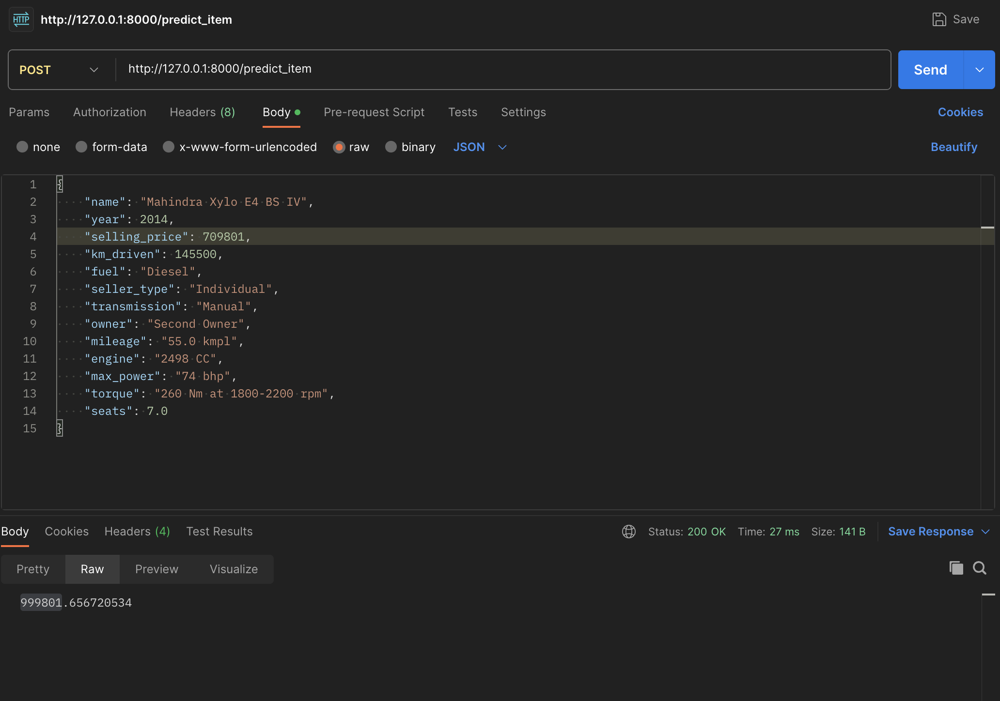
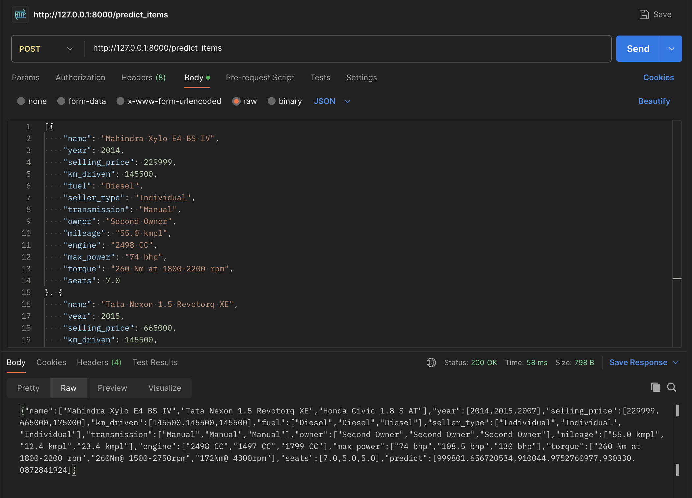

# Домашнее задание №1 по ML

## Лапшин Никита Валерьвич

# Что было сделано:

## EDA

1. Удалил дубликаты, пропуски во всех столбцах (и на трейн и на тест) заполнил медианами соответствующих столбцов из train.
2. Убрал единицы измерения у max_power, mileage, engine, преобразовал их к int и float. Также удалил столбце torque.
3. Реализовал визуализацию полученных данных с использованием **seaborn**. В частности отобразил heatMap и pairplot для поиска корреляций в данных.

## Модель только на вещественных признаках

1. Изначально попробовал обучить модель на классической линейной регрессии. Результат - R2 на тестовых данных = 0.5941
2. С помощью StandartScaler стандартизировал датасет, обучил модель с помощью Lasso-регрессии в паре с GridSearchCV (с 10 фолдами) на стандартизированных данных. Лучший коэфициент 30000 при 100 итерациях, 3 веса занулились (из-за L1-регуляризации). Результат - R2 на тесте = 0.5608
3. Обучил ElasticNet модель (которая использует и L1, и L2 регуляризацию) с помощью GridSearchCV. Результат - R2 на тесте = 0.5722

## Модель только на вещественных признаках и категориальных признаков

1. Использовал One-Hot кодирование для 'fuel', 'seller_type', 'transmission', 'owner', 'seats'.
2. С помощью Ridge (регрессия с L2-регуляризацией) в паре с GridSearchCV (с 10 фолдами) обучил модель. Результат - R2 на тесте = 0.6393

---

### Лучшая из рассмотренных моделей - Ridge (в FastApi использовал ее)

---

## Feature-enginiring

Не хватило сил и времени для этого пункта:(
Из идей - можно было бы использовать бренд автомобиля и torque (С onehot кодированием)

---

## Бизнесовая

## Реализовал кастомную метрику по требованию заказчика

## Реализация сервиса на FastApi

1. Реализовал два post-метода
2. Перенес код сервиса в отдельный файл
3. Протестировал данный сервис с помощью Postman

Ниже представлены скрины запросов и ответов

---

# Структура репозитория

1. HW1_Regression_with_inference.ipynb - Ноутбук с проделанной работой
2. server.py - сервис с реализацией FastAPI
3. col.pickle - сериализованные колонки датасета
4. model.pickle - сериализованная модель (GridSearch + Feature Engineering)
5. cars_test.csv - датасет для валидации
6. cars_train.csv - датасет для трейна
7. README.MD
8. License
9. Screens

---

## Выводы

1. Наилучший результат дал Ridge
